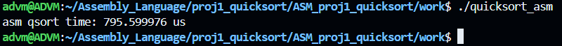
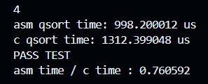
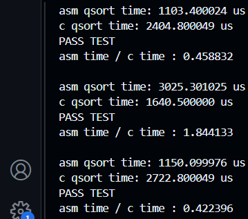

# 汇编语言 快排 实验报告

## 0. 实验概述

根据文件`partition.s`以及`quicksort.s`中的`partition_c`和`quicksort_c`函数（C语言），完善相应的`partition_asm`和`quicksort_asm`函数（汇编语言），实现快速排序的功能。

小组成员如下：

| **姓名** |    **学号**     |
| :------: | :-------------: |
|   周杰   | 2021K8009906003 |
|   法发   | 2021K8009908022 |
|  王静扬  | 2021K8009926004 |
|  余俊杰  | 2021K8009918017 |
|  韦欣池  | 2022K8009907004 |
|  姚永舟  | 2022K8009926016 |
|   杜璁   | 2022K8009926011 |
|  白银河  | 2021K8009907006 |
|   武弋   | 2022K8009929002 |
|  沈天一  | 2022K8009929005 |
|  谢翊凡  | 2022K8009929020 |

本实验使用`x86-64`汇编语言。程序在王静扬同学的电脑上运行，系统为WSL2 Ubuntu 20.04.3 LTS。

### 快速排序简介

快速排序是一种排序算法，利用递归实现数组的排序。步骤如下：

1. 从数列中挑出一个基准元素，其下标称为**pivot**；
2. 重新排序，**分划**(partition)数列：所有元素比基准值小的摆放在基准前面，所有元素比基准值大的摆在基准的后面，相同的数可以分到任一边；
3. 基准将数组分划为两个子数组（一个全部小于等于基准，另一全部大于等于基准），对这两个子数组使用快速排序，递归调用；

- 终止条件：待排序数组的长度小于零。

快排的最好时间复杂度为$\mathcal{O}(n \log n)$，最坏时间复杂度为$\mathcal{O}(n^2)$，平均时间复杂度为$\mathcal{O}(n \log n)$。最好情况是基准取到最中间的元素，分划出的两个子数组长度相差为0或1；最坏情况是基准取到最小或最大的元素，分划出的子数组中有一个为空。

## 1. 代码解析

实验涉及的代码有以下几个文件：

- `partition.s`

	分划函数`int partition_asm(int arr[], int low, int high)`的汇编语言实现。

- `quicksort.s`

	快排函数`void quicksort_asm(int arr[], int low, int high)`的汇编语言实现。

- `quicksort-main.c`

	包含主函数，以及一些功能函数。

- `quicksort.sh`

	Shell脚本，对上述文件进行编译与执行。

### 1.1 分划`partition.s`

这段代码实现的功能是快排的前两步——取基准与分划。

#### 1.1.1 C语言实现

该C代码包含在`quicksort-main.c`中，对一个整型数组`arr[]`中`arr[low] ~ arr[high]`这部分进行操作：以`arr[low]`作为基准`base`，

```c
int partition_c(int arr[], int low, int high)
{
	int base = arr[low];
	while(low < high) {
		while(low < high && arr[high] >= base)
			high--;
		arr[low] = arr[high];	// 从右边找到第一个小于或等于base的位置high

		while(low < high && arr[low] <= base)
			low++;
		arr[high] = arr[low];	// 从左边找到第一个大于或等于base的位置low
	}

	arr[low] = base;
	return low;
}
```


#### 1.1.2 汇编实现

汇编源码：

```assembly
.section .text
.globl partition_asm
.type partition_asm, @function

partition_asm:
    pushq %rbp
    movq %rsp, %rbp

    # rdi = arr
    # rsi = low
    # rdx = high

    movl (%rdi, %rsi, 4), %ebx  # ebx = base = arr[low]

loop_start:
    cmpq %rdx, %rsi             # compare low with high
    jge end_partition           # jump to end if low >= high
    
while1_start:
    movl (%rdi, %rdx, 4), %ecx  # ecx = arr[high]
    cmpq %rsi, %rdx		        # compare high with low
	jle while1_end
    cmp %ecx, %ebx              # compare arr[high] with base
    jg while1_end
	subq $1, %rdx               # high--
	jmp while1_start

while1_end:
	movl %ecx, (%rdi, %rsi, 4)  # arr[low] = arr[high]

while2_start:
    movl (%rdi, %rsi, 4), %ecx  # ecx = arr[low]
    cmpq %rsi, %rdx		        # compare high with low
	jle while2_end
    cmp %ebx, %ecx              # compare arr[low] with base
    jg while2_end
	addq $1, %rsi               # low++
	jmp while2_start

while2_end:
	movl %ecx, (%rdi, %rdx, 4)  # arr[low] = arr[high]
    jmp loop_start

end_partition:
	movl %ebx, (%rdi, %rsi, 4)	# arr[low] = base
    movq %rsi, %rax             # return low
    popq %rbp
    ret

.section .note.GNU-stack,"",@progbits
```

#### 1.2.3 代码思路解析

1. `pushq %rbp 和 movq %rsp, %rbp`：这两条指令用于设置新的栈帧。用于调用函数，对应于C程序中的函数开始部分。

2. `movl (%rdi, %rsi, 4), %ebx`：这条指令将arr[low]的值加载到寄存器%ebx中，对应于C程序中的int base = arr[low]。
3. `cmpq %rdx, %rsi 和 jge end_partition`：这两条指令实现了while(low < high)循环的条件检查。如果low大于或等于high，则跳转到end_partition标签处，结束分区过程。
4. `movl (%rdi, %rdx, 4), %ecx`：这条指令将arr[high]的值加载到寄存器%ecx中，对应于C程序中的arr[high]。

5. `cmpq %rsi, %rdx，jle while1_end，cmp %ecx, %ebx，jg while1_end，subq $1, %rdx，jmp while1_start`：这些指令实现了while(low < high && arr[high] >= base) high--;循环。如果arr[high]大于或等于base，且high大于low，则high减1，然后跳回while1_start继续循环。如果条件不满足，则跳到while1_end结束循环。

6. `movl %ecx, (%rdi, %rsi, 4)`：这条指令将寄存器%ecx中的值存储到arr[low]，对应于C程序中的arr[low] = arr[high]。

7. `movl (%rdi, %rsi, 4), %ecx`：这条指令将arr[low]的值加载到寄存器%ecx中，对应于C程序中的arr[low]。

8. `cmpq %rsi, %rdx，jle while2_end，cmp %ebx, %ecx，jg while2_end，addq $1, %rsi，jmp while2_start`：这些指令实现了while(low < high && arr[low] <= base) low++;循环。如果arr[low]小于或等于base，且high大于low，则low加1，然后跳回while2_start继续循环。如果条件不满足，则跳到while2_end结束循环。

9. `movl %ecx, (%rdi, %rdx, 4)`：这条指令将寄存器%ecx中的值存储到arr[high]，对应于C程序中的arr[high] = arr[low]。

10. `jmp loop_start`：这条指令使程序跳回loop_start标签处，继续执行外层的while(low < high)循环。

11. `movl %ebx, (%rdi, %rsi, 4)`：这条指令将寄存器%ebx中的值（即base）存储到arr[low]，对应于C程序中的arr[low] = base。

12. `movq %rsi, %rax`：这条指令将寄存器%rsi中的值（即low）加载到寄存器%rax中，对应于C程序中的return low。

13. `popq %rbp `和 `ret`：这两条指令用于结束函数调用。

### 1.2 快排`quicksort.s`

这段代码是用汇编语言实现的快速排序算法。它定义了一个名为 `quicksort_asm` 的函数，该函数接受三个参数：一个数组 `arr`，以及两个整数 `low` 和 `high`，分别表示要排序的数组部分的起始和结束索引。

#### 1.2.1 C语言实现

在C语言中，快排的实现如下所示：

```c
void quicksort_c(int arr[], int low, int high)
{
	if(low < high) {
		int pivot = partition_c(arr, low, high);
		quicksort_c(arr, low, pivot - 1);
		quicksort_c(arr, pivot + 1, high);
	}
}
```


#### 1.2.2 汇编实现


汇编完整代码如下：

```assembly
.section .text
.globl quicksort_asm
.type quicksort_asm, @function

quicksort_asm:
    pushq   %rbp               # 保存当前函数调用的基址指针
    movq    %rsp, %rbp         # 设置新的基址指针
    subq    $32, %rsp          # 分配32字节的栈空间用于局部变量和参数保存

    movq    %rdi, -24(%rbp)    # 将第一个参数(arr)存储到局部变量中
    movl    %esi, -28(%rbp)    # 将第二个参数(low)存储到局部变量中
    movl    %edx, -32(%rbp)    # 将第三个参数(high)存储到局部变量中

    movl    -28(%rbp), %eax    # 将low加载到eax寄存器
    cmpl    -32(%rbp), %eax    # 比较low和high
    jge     qsort_end          # 如果low >= high，则跳转到qsort_end结束函数

    # 调用partition_asm(arr, low, high)获取pivot
    movl    -32(%rbp), %edx    # 将high加载到edx寄存器
    movl    -28(%rbp), %ecx    # 将low加载到ecx寄存器
    movq    -24(%rbp), %rax    # 将arr加载到rax寄存器
    movl    %ecx, %esi         # 将low传递给esi寄存器作为第二个参数
    movq    %rax, %rdi         # 将arr传递给rdi寄存器作为第一个参数
    movl    $0, %eax           # 清零eax寄存器（用于传递额外的参数或返回值）
    call    partition_asm
    movl    %eax, -4(%rbp)     # 将返回值(pivot)存储到局部变量中

    # 递归调用quicksort_asm(arr, low, pivot - 1)
    movl    -4(%rbp), %eax     # 将pivot加载到eax寄存器
    leal    -1(%rax), %edx     # 计算pivot - 1，并存储到edx寄存器
    movl    -28(%rbp), %ecx    # 将low加载到ecx寄存器
    movq    -24(%rbp), %rax    # 将arr加载到rax寄存器
    movl    %ecx, %esi         # 将low传递给esi寄存器作为第二个参数
    movq    %rax, %rdi         # 将arr传递给rdi寄存器作为第一个参数
    call    quicksort_asm

    # 递归调用quicksort_asm(arr, pivot + 1, high)
    movl    -4(%rbp), %eax     # 将pivot加载到eax寄存器
    leal    1(%rax), %ecx      # 计算pivot + 1，并存储到ecx寄存器
    movl    -32(%rbp), %edx    # 将high加载到edx寄存器
    movq    -24(%rbp), %rax    # 将arr加载到rax寄存器
    movl    %ecx, %esi         # 将pivot + 1传递给esi寄存器作为第二个参数
    movq    %rax, %rdi         # 将arr传递给rdi寄存器作为第一个参数
    call    quicksort_asm

qsort_end:
    leave                      # 恢复栈帧并释放栈空间
    ret                        # 返回

.section .note.GNU-stack,"",@progbits

```


这段代码是用汇编语言实现的快速排序算法。它定义了一个名为 `quicksort_asm` 的函数，该函数接受三个参数：一个数组 `arr`，以及两个整数 `low` 和 `high`，分别表示要排序的数组部分的起始和结束索引。

#### 1.2.3 代码思路解析

##### 函数主体

```asm
quicksort_asm:

    pushq   %rbp              
    movq    %rsp, %rbp        
    subq    $32, %rsp         
    movq    %rdi, -24(%rbp)   
    movl    %esi, -28(%rbp)   
    movl    %edx, -32(%rbp)  
    movl    -28(%rbp), %eax   
    cmpl    -32(%rbp), %eax   
    jge     qsort_end         
```

1. `pushq %rbp`：将当前的基址指针（Base Pointer）压入栈中，以便在函数返回时可以恢复。

2. `movq %rsp, %rbp`：将栈指针（Stack Pointer）的值复制到基址指针。这样，基址指针就指向了新的栈帧的开始位置。

3. `subq $32, %rsp`：从栈指针中减去32，为函数的局部变量和参数在栈上分配空间。

4. `movq %rdi, -24(%rbp)`：将第一个参数（在rdi寄存器中）复制到基址指针向下偏移24个字节的位置，也就是在栈上为它分配的位置。

5. `movl %esi, -28(%rbp)`：将第二个参数（在esi寄存器中）复制到基址指针向下偏移28个字节的位置。

6. `movl %edx, -32(%rbp)`：将第三个参数（在edx寄存器中）复制到基址指针向下偏移32个字节的位置。

7. `movl -28(%rbp), %eax`：将存储在基址指针向下偏移28个字节位置的值（也就是第二个参数low）复制到eax寄存器。

8. `cmpl -32(%rbp), %eax`：将存储在基址指针向下偏移32个字节位置的值（也就是第三个参数high）与eax寄存器中的值（也就是low）进行比较。

9. `jge qsort_end`：如果low大于等于high（也就是数组中要排序的部分已经只剩下一个元素或者没有元素），则跳转到标签qsort_end，结束函数。

```asm
	movl    -32(%rbp), %edx   
    movl    -28(%rbp), %ecx    
    movq    -24(%rbp), %rax    
    movl    %ecx, %esi         
    movq    %rax, %rdi         
    movl    $0, %eax          
    call    partition_asm
    movl    %eax, -4(%rbp)     
```

1. `movq %rdi, -24(%rbp)`，`movl %esi, -28(%rbp)` 和 `movl %edx, -32(%rbp)` 是将函数的参数 `arr`，`low` 和 `high` 存储到栈上的局部变量中。

2. `movl -28(%rbp), %eax` 和 `cmpl -32(%rbp), %eax` 是比较 `low` 和 `high` 的值。如果 `low` 大于等于 `high`，则跳转到 `qsort_end` 结束函数。

3. 接下来的代码是调用 `partition_asm` 函数。
4. `movl    %eax, -4(%rbp) `    将返回值`pivot`存储到局部变量中。

##### 递归调用函数，对pivot左右两部分分别进行排序

```asm
    # 递归调用quicksort_asm(arr, low, pivot - 1)
    movl    -4(%rbp), %eax    
    leal    -1(%rax), %edx     
    movl    -28(%rbp), %ecx    
    movq    -24(%rbp), %rax    
    movl    %ecx, %esi       
    movq    %rax, %rdi         
    call    quicksort_asm

    # 递归调用quicksort_asm(arr, pivot + 1, high)
    movl    -4(%rbp), %eax    
    leal    1(%rax), %ecx      
    movl    -32(%rbp), %edx    
    movq    -24(%rbp), %rax    
    movl    %ecx, %esi         
    movq    %rax, %rdi        
    call    quicksort_asm
```

1. 代码递归地调用 `quicksort_asm` 函数，首先对 `pivot` 左边的部分进行排序，然后对 `pivot` 右边的部分进行排序。

##### 函数结束

```asm
qsort_end:
    leave                      
    ret                        
```

1. `leave` 和 `ret` 是在函数结束时恢复栈帧并返回。

```asm
.section .note.GNU-stack,"",@progbits
```

最后一行 `.section .note.GNU-stack,"",@progbits` 是一个特殊的节，它告诉链接器这个对象文件不需要可执行栈。这是一个安全特性，用于防止栈溢出攻击。

### 1.3 主文件`quicksort-main.c`

#### 1.3.1 功能函数

1. 数组随机填充函数`void fill_array_random(int arr[], int size, int lb, int ub)`

  利用随机的整数（`lb`\~`ub`之间），填充数组`arr[size]`。

  ```c
  #include <stdlib.h>
  void fill_array_random(int arr[], int size, int lb, int ub)
  {
      srand(time(0));
  	for(int i = 0; i < size; i++) {
  		arr[i] = (rand() % (ub - lb + 1)) + lb;
  	}
  }
  ```

2. 数组打印函数`void print_array(int arr[], int size)`

  依次打印数组`arr[size]`中的元素。

  ```c
  #include <stdio.h>
  void print_array(int arr[], int size)
  {
  	printf("%d", arr[0]);
  	for(int i = 1; i < size; i++)
  		printf(", %d", arr[i]);
  }
  ```

3. 检查函数`void check(int test[], int trust[], int size)`

  检查待测数组`test[size]`是否与已知数组`trust[size]`一致。

  ```c
  #include <stdio.h>
  void check(int test[], int trust[], int size)
  {
  	for(int i = 0; i < size; i++) {
  		if(test[i] != trust[i]) {
  			printf("ARR[%d] SHOULD BE %d, BUT GOT %d.\n", i, trust[i], test[i]);	
  			printf("TEST FAILED\n");
  			return;
  		}
  	}
  	printf("PASS TEST\n");
  }
  ```

4. C语言分划函数`int partition_c(int arr[], int low, int high)`

5. C语言快排函数`void quicksort_c(int arr[], int low, int high)`

最后两个函数已在上文解释，这里不再赘述。

#### 1.3.2 主函数

主函数实现的功能：

- 在编译时定义宏`TEST`

	随机生成数组`int array_asm[MAX_SIZE]`，分别利用汇编语言和C语言的函数（`quicksort_asm()`和`quicksort_c()`）对该数组进行快排；检测两者的快排结果是否一致；<u>对比快排步骤的用时</u>。

- 在编译时不定义宏`TEST`

	仅使用汇编语言的`quicksort_asm()`进行快排，输出其用时。

```c
#include <stdio.h>
#include <stdlib.h>
#include <time.h>
#include <sys/time.h>
#include <string.h>

int main()
{
	float c_duration = 0;
	struct timespec c_start_time = {0, 0};
	struct timespec c_end_time = {0, 0};
	float asm_duration = 0;
	struct timespec asm_start_time = {0, 0};
	struct timespec asm_end_time = {0, 0};
	int Converter = 1000 * 1000 * 1000;

	int *array_asm= malloc(sizeof(int) * MAX_SIZE);
	fill_array_random(array_asm, MAX_SIZE, LB, UB);

#ifdef TEST
	int *array_c= malloc(sizeof(int) * MAX_SIZE);
	memcpy(array_c, array_asm, sizeof(int) * MAX_SIZE);
#endif
	clock_gettime(CLOCK_REALTIME, &asm_start_time);
	quicksort_asm(array_asm, 0, MAX_SIZE - 1);
	clock_gettime(CLOCK_REALTIME, &asm_end_time);
	asm_duration = (asm_end_time.tv_sec * Converter + asm_end_time.tv_nsec) 
			   - (asm_start_time.tv_sec * Converter + asm_start_time.tv_nsec);
	printf("asm qsort time: %f us\n",asm_duration/1000);

#ifdef TEST
	clock_gettime(CLOCK_REALTIME, &c_start_time);

	quicksort_c(array_c, 0, MAX_SIZE - 1);

	clock_gettime(CLOCK_REALTIME, &c_end_time);
	c_duration = (c_end_time.tv_sec * Converter + c_end_time.tv_nsec) 
			   - (c_start_time.tv_sec * Converter + c_start_time.tv_nsec);
	printf("c qsort time: %f us\n",c_duration/1000);
	check(array_asm, array_c, MAX_SIZE);
	printf("asm time / c time : %f\n\n",asm_duration/c_duration);
#endif
	// print_array(array_asm, MAX_SIZE);	
	return 0;
}
```

主函数详解：（这里展示最完整的逻辑，即定义宏`TEST`时的情况）

- 初始化

	利用`malloc()`为数组`array_asm[MAXSIZE]`分配空间；

	利用`fill_array_random()`随机填充`array_asm[]`数组；

	利用`memcpy()`复制`array_asm[]`到`array_c[]`，后者用于C语言的快排。

- 汇编快排

	利用`clock_gettime()`获取汇编快排的起始时刻`asm_start_time`；

	对`arrat_asm[]`执行汇编快排`quicksort_asm`（已使用`extern`关键字声明）；

	利用`clock_gettime()`获取汇编快排的终止时刻`asm_end_time`；

	计算汇编快排用时`asm_duration`，并打印（单位换算为微秒）。

- C快排

	利用`clock_gettime()`获取C快排的起始时刻`c_start_time`；

	对`arrat_c[]`执行C快排`quicksort_c`；

	利用`clock_gettime()`获取C快排的终止时刻`c_end_time`；

	计算C快排用时`c_duration`，并打印（单位换算为微秒）

- 结果对比

	利用`check()`对比两种快排的结果；

	计算两种快排所需时间的比值`asm_duration / c_duration`。

为使输出更简洁，不再打印数组。

### 1.4 Shell脚本`quicksort.sh`

```shell
#!/bin/bash
as -gstabs -o partition.o partition.s
as -gstabs -o quicksort.o quicksort.s
gcc -g -static -DTEST -o quicksort partition.o quicksort.o quicksort-main.c
for i in {1..25}; do
	echo $i
    ./quicksort
done
```

通过汇编器`as`将汇编源码`partition.s`和`quicksort.s`汇编为目标代码文件`partition.o`与`quicksort.o`。

通过`gcc`将全部代码文件(`partition.o`, `quicksort.o`, `quicksort-main.c`)编译为可执行文件`quicksort`。参数`-DTEST`表示在编译时定义宏`TEST`，若不想定义，删去即可。

利用for循环执行25次`quicksort`，降低实验的偶然性。

## 2. 实验步骤

1. 完善提供的代码。
2. 添加Shell脚本的执行权限：`chmod +x quicksort.sh`。
3. 运行Shell脚本`./quicksort.sh`。
4. 对比汇编快排与C快排的使用时间。

## 3. 运行结果与实验数据

### 3.1 汇编快排单独、单次运行结果

仅执行汇编快排，使用如下代码编译和运行：

```bash
$ as -gstabs -o partition.o partition.s
$ as -gstabs -o quicksort.o quicksort.s
$ gcc -g -static partition.o quicksort.o quicksort-main.c -o quicksort_asm
$ ./quicksort_asm
```

运行结果如下图所示



### 3.2 对比运行结果

对比汇编快排与C快排，使用Shell脚本`quicksort.sh`，单次输出格式如下所示：



两者的排序结果均一致，用时数据统计在下表中：

| **次数** | **汇编快排用时(us)** | **C快排用时(us)** |  **汇编用时/C用时**  |
| :------: | :------------------: | :---------------: | :------------------: |
|    1     |      845.999023      |    1353.599976    |       0.624999       |
|    2     |      884.700012      |    1450.198975    |       0.610054       |
|    3     |      798.799988      |    1293.298950    |       0.617645       |
|    4     |      998.200012      |    1312.399048    |       0.760592       |
|    5     |      800.599976      |    1461.999023    |       0.547606       |
|    6     |      827.000000      |    1300.499023    |       0.635910       |
|    7     |      766.500000      |    1138.099976    |       0.673491       |
|    8     |      764.400024      |    1427.699951    |       0.535407       |
|    9     |      840.900024      |    1240.300049    |       0.677981       |
|    10    |      936.698975      |    1251.500000    |       0.748461       |
|    11    |      788.098999      |    1209.099976    |       0.651806       |
|    12    |      796.299011      |    1254.300049    |       0.634855       |
|    13    |      793.500000      |    1354.598999    |       0.585782       |
|    14    |      779.099976      |    1250.098999    |       0.623231       |
|    15    |      795.299988      |    1324.098999    |       0.600635       |
|    16    |      857.000000      |    1478.499023    |       0.579642       |
|    17    |      795.799988      |    1216.400024    |       0.654226       |
|    18    |      812.200012      |    1213.000000    |       0.669580       |
|    19    |      825.598999      |    1264.199951    |       0.653060       |
|    20    |      799.499023      |    1240.300049    |       0.644601       |
|    21    |      787.500000      |    1240.698975    |       0.634723       |
|    22    |      798.200012      |    1292.598999    |       0.617516       |
|    23    |      795.400024      |    1262.798950    |       0.629871       |
|    24    |      823.500000      |    1457.900024    |       0.564854       |
|    25    |      781.000000      |    1223.199951    |       0.638489       |
|   平均   |      819.671763      |    1300.455518    | 0.632601<br>0.630296 |

注：汇编快排用时/C快排用时的平均值就是该列25个数据的平均值；用时比值的平均值有两个，上面的为25个比值的平均值，下面的为两个用时平均值相除

从用时数据中我们可以看出，汇编快排快于C快排，平均下来前者用时约为后者的0.63倍。

### 3.3 反常现象

在某次测试中发现汇编快排反而慢于C快排，前者用时约为后者的1.84倍，如下图中间所示。暂未能解释该现象。



## 4. 实验总结

​	本次实验中，小组成员通过编写partition.s和quicksort.s，更加熟悉了x86-64汇编中的数组访问、while控制流以及函数调用等相关知识。我们还通过对quicksort-main.c的改编，比较了我们所写快排汇编程序与gcc默认编译出的快排程序的性能差异。在我们的实验结果中，绝大部分时候，汇编快排快于C快排。由此，我们小组成员增强了代码优化意识，这将有利于我们今后的编程工作。
